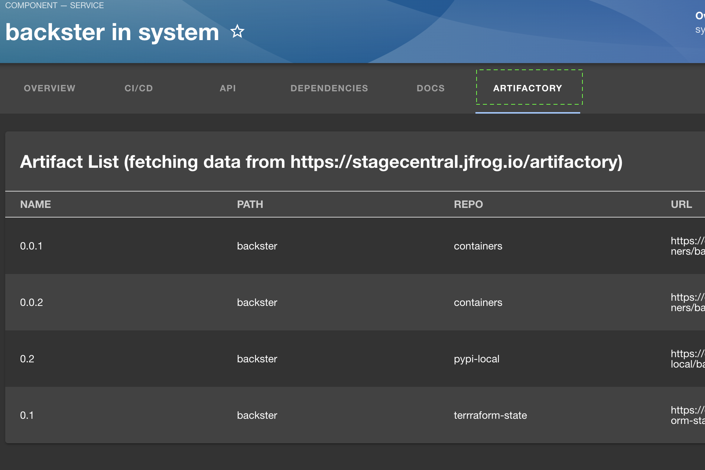

# [Jfrog](https://jfrog.com) Artifactory Plugins for [Backstage](https://backstage.io) by [StageCentral](https:..stagecentral.io)

---

Welcome to the Artifactory plugin suite for Backstage!

This is a combination of 2 plugins - the [frontend](./plugins/artifactory/README.md) and the [backend](./plugins/artifactory-backend/README.md).

The purpose of these plugins is to bring software artifacts forward - where developers can see them.
You can now easily connect your software components and services to their binary artifacts and browse the relevant artifacts directly from your Bacsktage IDP.

## The Frontend

Currently the frontend plugin allows you to add a tab showing the list of the artifacts related to a Backstage entity:

Artifacts are matched by their name or property.
Default property name is `catalog.component` but is configurable.

Brought to you with love by [StageCentral](https://stagecentral.io)

